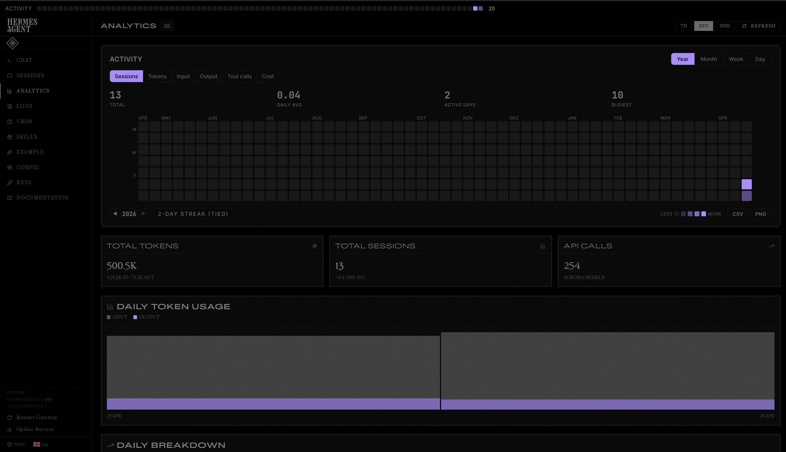

# Void

An ultra-minimalist dashboard theme for [Hermes Agent](https://hermes-agent.nousresearch.com/).

## About

Void strips everything back to pure black with subtle grays and a single ghostly lavender accent. Built for distraction-free focus.

- **Palette:** Pure black (`#000000`) with neutral gray midground (`#737373`) and lavender (`#a78bfa`) accent
- **Typography:** Inter + JetBrains Mono
- **Density:** Compact with 0 corner radius
- **Extras:** Token usage graph colors remapped—input gray, output lavender

## Installation

1. Copy `void.yaml` to `~/.hermes/dashboard-themes/`
2. Run `hermes dashboard`
3. Click the palette icon in the header bar and select **Void**

## Custom Graph Colors

The theme overrides the daily token usage graph colors:
- Input bars: gray (`#525252`)
- Output bars: lavender (`#a78bfa`)

## License

MIT
